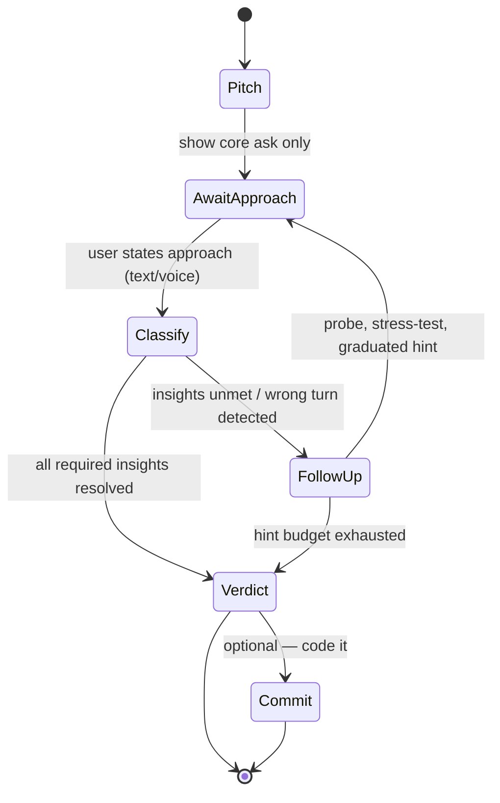
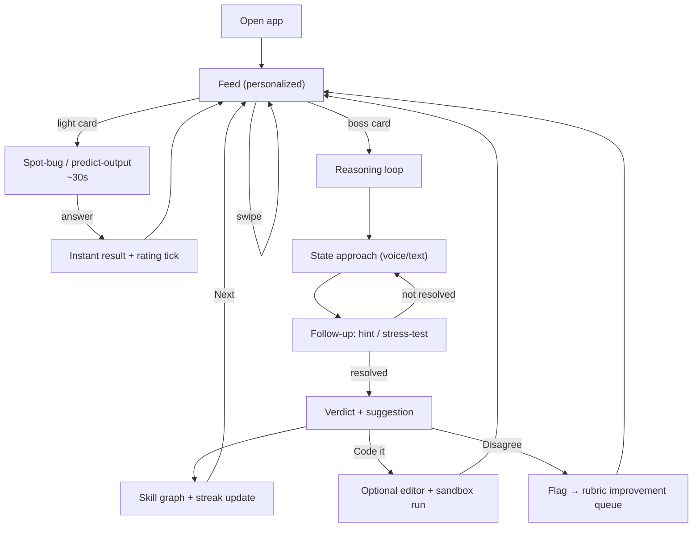
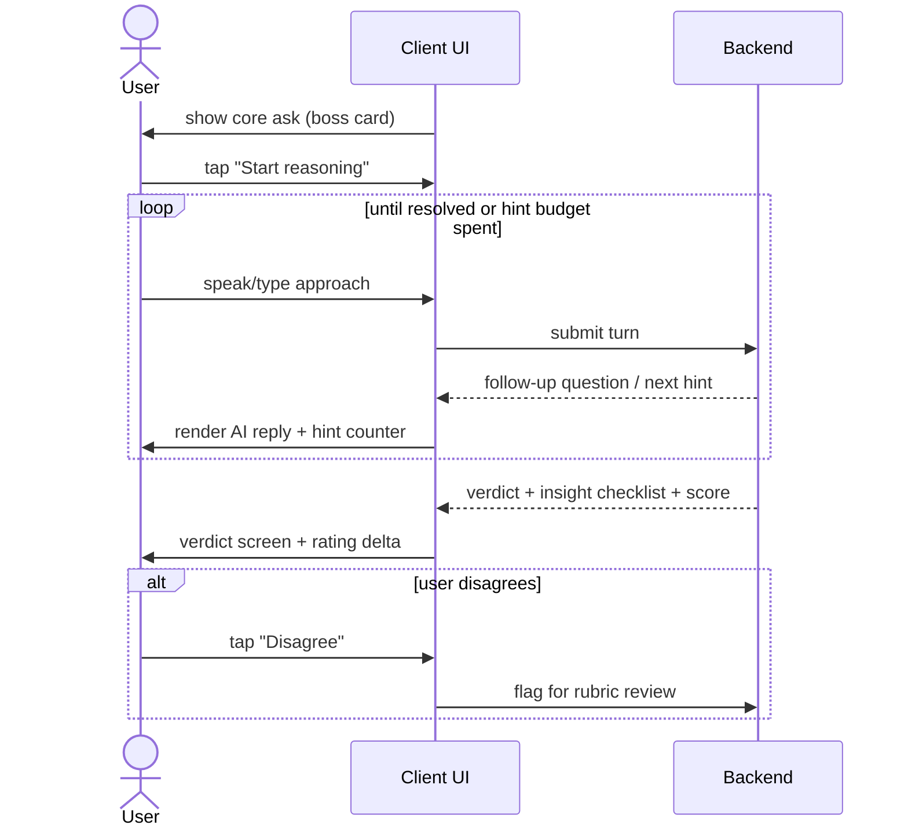
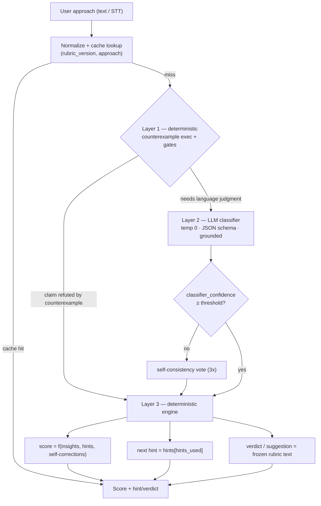
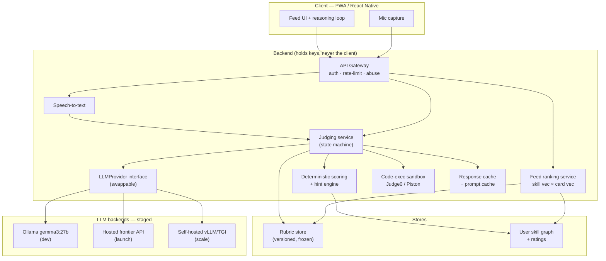
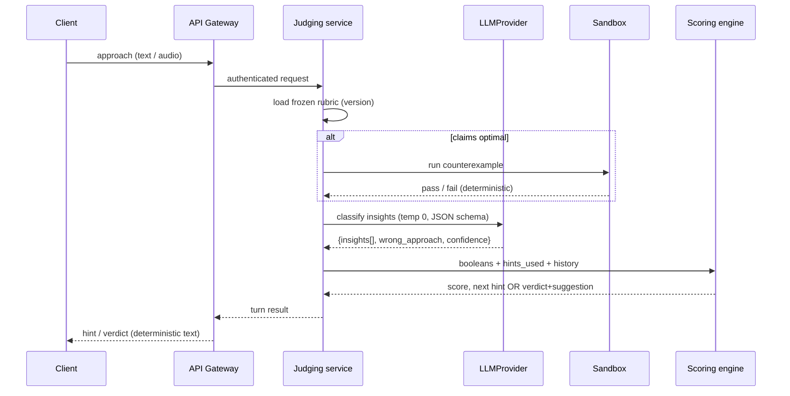

# PRD: "Reason" — a reasoning gym for the AI era

> Working title. Status: draft for review. Owner: TBD.

## 1. Overview

A short-form, mobile-first platform that keeps engineers' problem-solving sharp by
training the one skill AI can't do for them: **reasoning toward a solution out loud.**
Instead of writing code, users are given the *core ask* of a problem (like a friend
describing it after a contest), explain their *approach* verbally or in text, and get a
Socratic follow-up loop — hints, stress-tests, and a final verdict with suggestions —
graded against a deterministic, pre-authored rubric.

## 2. Problem & Motivation

- AI has made code *output* cheap; the durable skill is decomposition, algorithmic
  intuition, complexity reasoning, and debugging judgment.
- Existing platforms (LeetCode/Codeforces) train *writing the solution* — increasingly
  automatable and increasingly gamed by AI.
- Engineers feel their problem-solving atrophying ("vibe coding") and want a low-friction
  habit to stay sharp.
- Interviews are moving toward AI-proof, reason-out-loud formats — there's no good
  training ground for that.

## 3. Goals & Non-Goals

**Goals**
- Train and measure *reasoning quality*, not code correctness.
- Build a daily habit via a personalized, swipeable short-form feed.
- Make grading feel as sharp and fair as a smart friend — and be **deterministic/reproducible**.
- Be defensibly AI-resistant (hard to cheat by pasting into an LLM).

**Non-Goals (v1)**
- Not a full online judge / code-execution contest platform.
- Not competing on problem *breadth* with LeetCode.
- No custom/fine-tuned model, no self-hosted GPU infra at launch.
- No native mobile app at launch (PWA/React Native first).

## 4. Target Users

- **Primary:** working engineers (mid/senior) fighting skill atrophy.
- **Secondary:** interview-preppers wanting reason-out-loud practice.
- **Later:** serious competitive programmers; students.

*(Decide primary persona before build — it shapes problem difficulty and tone.)*

## 5. Core Concept: the "friend after the contest" loop

The signature interaction. A state machine, not a free chat:

1. **The pitch** — show only the core ask, stripped of constraints/examples.
2. **Approach capture** — user explains their approach (text or voice → STT).
3. **Follow-up loop** — AI probes *reasoning*: clarifying ("why end time?"),
   stress-testing ("what if ties?"), complexity ("can you do better?"), graduated hints
   when stuck.
4. **Verdict** — correct / optimal / buggy / brute-force, with the specific gap named and
   a suggestion for the better path.
5. **(Optional) commit** — code it or move on.

**Rules:** ask before telling; hints are graduated (nudge → leading → reveal); the
*reasoning* is the graded artifact.



## 6. The Feed (engagement layer)

An infinite vertical feed, ranked by the user's skill graph + chosen practice track:

- **Card types:** micro-problem, spot-the-bug (AI code with subtle flaw),
  predict-the-output, pattern flashcard (spaced repetition), full "boss" problem (the
  reasoning loop), creator/replay shorts.
- **Pacing:** interleave light cards (habit) with heavy reasoning cards (skill).
- **Adaptive difficulty:** Elo-style; target ~60–80% success (flow state); misses
  resurface the weak pattern on a forgetting curve.
- **Hooks:** daily streak ("5 cards/day"), rated speed-runs, shareable "I cracked this in
  22s" challenges (viral loop).

## 7. UX & Wireframes

Low-fidelity wireframes for the core mobile screens. These show *layout and intent*, not
final visual design.

### 7.1 The feed (vertical, swipeable)

A full-screen card per challenge; swipe up for the next. Card chrome stays consistent;
the body changes by card type.

```
┌─────────────────────────────┐
│  🔥 7    Greedy · 1200    ⚙ │  ← streak · topic/rating · settings
│                             │
│   ┌───────── card ───────┐  │
│   │  BOSS · Reasoning     │  │  ← card-type badge
│   │                       │  │
│   │  "You have a list of  │  │
│   │   meetings. Max you   │  │   core ask only —
│   │   can attend without  │  │   no constraints/examples
│   │   overlapping?"       │  │
│   │                       │  │
│   │  ⏱ ~2 min  · 🎙/⌨ reply│  │
│   └───────────────────────┘  │
│                             │
│   [ Start reasoning ▶ ]     │  ← primary CTA
│                             │
│   ▲ swipe for next          │
│  ───────────────────────────│
│  Feed   Practice  Profile   │  ← bottom nav
└─────────────────────────────┘
```

A *light* card (spot-the-bug) reuses the same frame:

```
┌─────────────────────────────┐
│  🔥 7    Debug · 1150     ⚙ │
│   ┌───────────────────────┐ │
│   │  SPOT THE BUG         │ │
│   │  for i in range(n):   │ │
│   │    if a[i] > a[i+1]:  │ │ ← tap the buggy line
│   │      swap(i, i+1)     │ │
│   │  return a             │ │
│   │                       │ │
│   │  Tap the line that    │ │
│   │  breaks. ⏱ 30s        │ │
│   └───────────────────────┘ │
└─────────────────────────────┘
```

### 7.2 The reasoning loop (the signature screen)

A chat-like surface, but driven by the state machine — mic-first, with a text fallback.

```
┌─────────────────────────────┐
│ ‹ Back        Greedy · 1200 │
│─────────────────────────────│
│  CORE ASK                   │
│  Max non-overlapping        │
│  meetings you can attend.   │
│─────────────────────────────│
│                             │
│  🧑 "I'd sort by start time  │  ← user's approach (you)
│      and pick greedily."    │
│                             │
│  🤖 "Why start time? What    │  ← AI follow-up (Socratic)
│      happens with one long  │
│      early meeting?"        │
│                             │
│  🧑 "...hmm, it blocks short │
│      ones. Sort by end?"    │
│                             │
│  🤖 "Walk me through         │  ← grounded counterexample
│      [[1,10],[2,3],[4,5]]." │
│                             │
│  · · · hint 1 of 3 used     │  ← graduated-hint budget
│─────────────────────────────│
│  [ 🎙 Hold to speak ]  [⌨]  │  ← voice-first, text fallback
└─────────────────────────────┘
```

### 7.3 The verdict (graded reasoning, not pass/fail)

Shows the insight checklist, score, hint cost, and the next-step suggestion.

```
┌─────────────────────────────┐
│         VERDICT             │
│      ✦ Optimal reached ✦    │
│       Score  82 / 100       │
│─────────────────────────────│
│  Insights                   │
│   ✓ Recognized sorting      │
│   ✓ Sorted by END time      │
│   ✓ Justified greedy        │
│   ✗ Stated complexity       │ ← missed
│─────────────────────────────│
│  −10  used 1 hint           │
│  +5   self-corrected        │
│─────────────────────────────│
│  💡 Next: practice stating   │
│     time complexity — you   │
│     skipped O(n log n).     │
│─────────────────────────────│
│  Rating  Greedy 1200 → 1218 │ ← skill graph update
│  [ Next ▶ ]   [ Code it ⌨ ] │
│  [ 🚩 Disagree with verdict ]│ ← feeds rubric improvement
└─────────────────────────────┘
```

### 7.4 Profile / skill graph (retention surface)

Visualizes streak, per-topic mastery, and *decay* (the loss-aversion hook).

```
┌─────────────────────────────┐
│  Profile           🔥 7-day │
│─────────────────────────────│
│  Skill by pattern           │
│  Arrays    ███████░░  1320  │
│  Greedy    ██████░░░  1218 ↑│
│  DP        ███░░░░░░   980 ↓│ ← decaying, resurfaces in feed
│  Graphs    ████░░░░░  1100  │
│─────────────────────────────│
│  This week   24 problems    │
│  ▁▃▅▂▆▇▄  (daily activity)  │
│─────────────────────────────│
│  [ Share my streak ]        │ ← viral loop
└─────────────────────────────┘
```

### 7.5 End-to-end user flow



### 7.6 Client ↔ user interaction during a turn



## 8. Grading & Determinism (the core IP)

**Principle:** the LLM does only a narrow fuzzy-classification step; everything the user
perceives as judgment (score, hint, suggestion, verdict) is produced by deterministic
code from frozen, human-verified content.

**Layered validation:**
- **Layer 1 — deterministic code:** execute the rubric's counterexample against the
  claimed approach (real pass/fail), keyword/complexity gates.
- **Layer 2 — constrained LLM classifier:** per-insight `yes/partial/no + evidence quote`,
  temp 0, JSON-schema-constrained, grounded on the rubric, cached, self-consistency vote
  on borderline calls.
- **Layer 3 — deterministic engine:** score math, hint-ladder lookup, verdict/suggestion
  text — all fixed.

**Determinism levers:** temp 0, cached static rubric, constrained decoding,
self-consistency, cache by `(rubric version, normalized approach)`, confidence-threshold
escalation to a clarifying question.



> Everything the user perceives — score, hint, suggestion, verdict — is produced by
> deterministic code (Layers 1 & 3) from frozen content. The LLM (Layer 2) only converts
> natural language into a few structured booleans.

### 8.1 Rubric schema (the deterministic asset)

```yaml
problem_id: meeting-rooms-greedy
rubric_version: 3
pattern: greedy
difficulty: 1200            # Elo-style
core_ask: "Given meetings with start/end times, find the max you can attend without overlap."

optimal:
  approach: "Sort by end time; greedily pick earliest-ending non-overlapping."
  complexity: { time: "O(n log n)", space: "O(1)" }
  key_insight: "Earliest end time leaves the most room for future meetings."

acceptable_alternatives:
  - approach: "Weighted interval scheduling DP"
    note: "Correct but overkill; accept, note simpler greedy exists."

common_wrong_approaches:
  - id: sort_by_start
    match_signals: ["sort by start", "earliest start", "begin time"]
    why_wrong: "One long early meeting blocks many short ones."
    counterexample: "[[1,10],[2,3],[4,5]]"     # executed in Layer 1
  - id: sort_by_duration
    match_signals: ["shortest", "by duration", "by length"]
    why_wrong: "Shortest-first ignores position."
    counterexample: "[[1,5],[4,6],[6,7]]"

required_insights:
  - id: needs_sorting
    desc: "Recognizes sorting is needed"
    weight: 1
    hints: ["Is the input order helpful as-is?",
            "Would processing them in some order help?",
            "You'll want to sort them first."]
  - id: sort_by_end
    desc: "Sorts by END time specifically"
    weight: 3
    hints: ["What ordering helps most?",
            "Which meeting frees you up soonest?",
            "Sort by end time — earliest first."]
    on_fail_suggestion: "You sorted by start; a long early meeting blocks many short ones. Re-derive with end-time."
  - id: greedy_justification
    desc: "Justifies why greedy is optimal"
    weight: 2
    hints: ["Why is always taking the earliest-ending safe?",
            "What does picking earliest-end guarantee about remaining time?"]
  - id: complexity
    desc: "States O(n log n)"
    weight: 1
    hints: ["What dominates the cost?", "What does the sort cost?"]

edge_cases: ["empty list", "all overlapping", "ties on end time"]

scoring:
  formula: "sum(weight of insights hit) / sum(all weights)"
  hint_penalty_per_reveal: 0.1
  self_correction_bonus: 0.05
```

### 8.2 Layer-2 classifier prompt (sketch)

> **System:** You are a grading classifier, not a tutor. Given a problem's required
> insights and a student's stated approach, decide for **each insight** whether the
> student's words satisfy it. Judge ONLY against the provided rubric. Do NOT praise, do
> NOT give hints, do NOT add commentary. If evidence is absent, return `no`. Output
> **only** valid JSON matching the schema.

> **User:** `{ core_ask, required_insights[], common_wrong_approaches[], conversation_so_far, latest_user_message }`

**Output schema:**

```json
{
  "insights": [
    { "id": "sort_by_end", "status": "yes|partial|no", "evidence": "<quote or null>" }
  ],
  "matched_wrong_approach": "sort_by_start | null",
  "claims_optimal": true,
  "classifier_confidence": 0.0
}
```

The deterministic engine consumes this JSON → updates score, picks the next hint or
counterexample, or renders the verdict.

## 9. Rating System

- Per-topic skill rating from reasoning quality: insights reached, hints consumed
  (fewer = higher), self-corrections under stress-test, time-to-key-insight.
- Feeds back into feed ranking → closed loop: *feed serves at your level → you reason →
  reasoning graded → rating updates → feed adapts.*

## 10. Architecture



**Client:** PWA first (or React Native for push + app stores sooner). Mic capture on
client; **all LLM calls proxied through backend.** Client never holds a model or key.

**Backend services:**
- API gateway (auth, rate-limit, abuse protection).
- **Judging service** — runs the state machine + layered validation.
- **`LLMProvider` interface** — swappable: `OllamaProvider` (dev) / `HostedProvider`
  (launch) / `vLLMProvider` (later self-host). Stage changes = config, not rewrite.
- Deterministic scoring/hint engine.
- Code-execution sandbox (Judge0/Piston) for counterexamples + optional code commit.
- Feed ranking service (skill vector × card vector).
- Content/rubric store (versioned, frozen).

**Inference strategy (staged):**
1. **Dev:** `gemma3:27b` on local Ollama — free iteration.
2. **Launch:** hosted frontier API — no GPUs, cheap at low volume, best quality.
   Prompt-cache the static rubric.
3. **Scale:** self-host open model via **vLLM/TGI** on AWS GPUs *only* when sustained
   volume beats per-call API cost AND golden-test benchmarks pass.
4. **Custom model:** fine-tune on graded sessions only with data + a measured,
   prompt-unclosable quality gap. Likely Phase 4+.

**Single judging turn (request flow):**



## 11. Tech Implementation & High-Level LLD

Design intent: a **deterministic core** (scoring, hint selection, state machine) kept pure
and fully unit-testable, with all non-determinism (LLM, sandbox, DB, STT) pushed to the
edges behind interfaces — a ports-and-adapters (hexagonal) layout. This is what makes the
grading reproducible and the LLM provider swappable.

### 11.1 Language & stack choices

| Layer | Choice | Rationale |
|---|---|---|
| Client | **TypeScript + React** (PWA via Vite → React Native later) | One language with backend; fast iteration; RN reuses most logic for native + push |
| API / judging service | **TypeScript (NestJS)** or **Go** | TS = shared types with client + speed to MVP; Go = stronger concurrency if throughput demands. Start TS, isolate the judging service so it can be re-implemented in Go later |
| Content / LLM orchestration | **Python** | Best LLM/eval/data ecosystem; runs the offline rubric-authoring + golden-test harness |
| Primary datastore | **PostgreSQL** | Relational integrity for users/sessions/ratings; `pgvector` for semantic answer-cache; JSONB for flexible turn payloads |
| Cache / queue | **Redis** | Response + prompt cache, rate-limit counters, async job queue (rubric validation, feed precompute) |
| Rubric store | **Versioned YAML in repo** → object store (S3) | Reviewed via PRs, frozen by version, loaded into Postgres index on deploy |
| Sandbox | **Judge0 / Piston** (self-host) | Counterexample execution + optional code-commit runs; never build a judge from scratch |
| LLM (staged) | Ollama (dev) → hosted API (launch) → vLLM (scale) | Behind one `LLMProvider` interface (see §10) |

### 11.2 Data model (core tables)

```
users(id, handle, created_at, ...)

problems(id, slug, pattern, base_difficulty, core_ask, created_at)

rubrics(id, problem_id, version, status, body_jsonb, created_at)
  -- body_jsonb = the frozen rubric (optimal, insights, wrong_approaches, hints, scoring)
  -- UNIQUE(problem_id, version); a session pins exactly one rubric row

sessions(id, user_id, problem_id, rubric_id, state, score, hints_used,
         started_at, ended_at)
  -- state: PITCH | AWAIT_APPROACH | FOLLOW_UP | VERDICT | COMMITTED

turns(id, session_id, idx, role, content, audio_url,
      classifier_output_jsonb, created_at)
  -- role: USER | AI ; idempotency via UNIQUE(session_id, idx)

insight_results(session_id, insight_id, status, evidence, resolved_at_turn)
  -- status: yes | partial | no  (the deterministic scoring inputs)

ratings(user_id, pattern, rating, last_practiced_at, decay_at)
  -- per-topic Elo; decay_at drives spaced-repetition resurfacing

verdict_flags(id, session_id, user_id, reason, created_at, status)
  -- "disagree" escape hatch → rubric improvement queue

card_events(id, user_id, card_id, card_type, outcome, latency_ms, created_at)
  -- feed impressions/outcomes → ranking + rating signal
```

### 11.3 Module boundaries (ports & adapters)

```
            ┌──────────────────────── Deterministic core (pure, no I/O) ───────────────────────┐
            │  SessionStateMachine   ScoringEngine   HintSelector   RubricInterpreter           │
            └───────▲───────────────────▲────────────────▲───────────────────▲──────────────────┘
                    │ ports (interfaces)                                       
   ┌────────────────┴───────┬───────────────┬──────────────────┬──────────────────────┐
   │ LLMProvider            │ SandboxRunner  │ SessionRepo       │ RubricRepo / Cache   │
   │ (Ollama|Hosted|vLLM)   │ (Judge0)       │ (Postgres)        │ (S3+PG / Redis)      │
   └────────────────────────┴───────────────┴──────────────────┴──────────────────────┘
```

The core takes a rubric + conversation state and returns the next action; adapters do the
I/O. Unit tests exercise the core with a `FakeLLMProvider` returning canned classifications
— no network, fully deterministic.

### 11.4 Key interfaces (illustrative, TypeScript)

```typescript
// --- Port: the only LLM touchpoint, a narrow classifier ---
interface LLMProvider {
  classify(input: ClassifyRequest): Promise<ClassifyResult>;
}

interface ClassifyRequest {
  coreAsk: string;
  requiredInsights: InsightSpec[];
  wrongApproaches: WrongApproachSpec[];
  history: TurnView[];
  latestUserMessage: string;
}

interface ClassifyResult {
  insights: { id: string; status: "yes" | "partial" | "no"; evidence: string | null }[];
  matchedWrongApproach: string | null;
  claimsOptimal: boolean;
  confidence: number; // drives self-consistency / escalation
}

// --- Deterministic core: no I/O, pure function of (state, classification) ---
type TurnAction =
  | { kind: "follow_up"; text: string }      // a probe (from rubric)
  | { kind: "hint"; insightId: string; text: string }
  | { kind: "counterexample"; insightId: string; input: string }
  | { kind: "verdict"; verdict: Verdict };

interface ReasoningCore {
  next(state: SessionState, rubric: Rubric, c: ClassifyResult): TurnAction;
}

interface ScoringEngine {
  // pure: same inputs -> same score, always
  score(insights: InsightResult[], hintsUsed: number, selfCorrections: number,
        rubric: Rubric): number;
}
```

### 11.5 Turn-processing algorithm (the orchestration)

```
handleTurn(sessionId, userMessage, idempotencyKey):
  1. load session + pinned rubric (by version)         # repo
  2. if turn(idempotencyKey) exists -> return cached result   # idempotency
  3. cacheKey = hash(rubric.version, normalize(userMessage), historyHash)
     if cache.has(cacheKey) -> classification = cache.get(cacheKey)   # determinism + cost
     else:
        if classification.claimsOptimal:                # Layer 1 first
            run rubric counterexample in sandbox
            if refuted -> short-circuit to counterexample action
        classification = llm.classify(...)              # Layer 2 (temp 0, JSON schema)
        if classification.confidence < T: classification = selfConsistency(3)
        cache.set(cacheKey, classification)
  4. action = core.next(state, rubric, classification)  # Layer 3 (pure)
  5. persist turn + insight_results; update session.state
  6. if action.kind == "verdict": update ratings (Elo + decay)
  7. return action
```

Steps 1–2, 5–7 are I/O; step 4 is pure. The LLM is touched only in step 3 and only as a
classifier — everything the user sees (hint text, verdict, score) comes from steps 3-Layer1
or 4.

### 11.6 API surface (REST, illustrative)

```
POST /sessions                  -> start; returns { sessionId, coreAsk }
POST /sessions/{id}/turns       -> body { message | audioRef, idempotencyKey }
                                   returns next TurnAction (follow-up | hint | verdict)
GET  /sessions/{id}             -> full transcript + state (resume)
POST /sessions/{id}/disagree    -> body { reason } -> verdict_flags
POST /sessions/{id}/code        -> optional code submission -> sandbox result
GET  /feed?cursor=...           -> ranked cards for the user
GET  /me/skills                 -> per-topic ratings + decay (profile screen)
POST /media/stt                 -> audio -> text (voice path)
```

### 11.7 Cross-cutting best practices

- **LLM reliability:** strict JSON-schema validation on every classification; reject +
  one bounded retry on malformed output; per-call timeout; circuit-breaker + graceful
  degradation (fall back to a clarifying follow-up if the provider is down).
- **Determinism guardrails:** `temperature=0`, pinned model + prompt version stamped onto
  each session; cache by `(rubric_version, normalized_approach, history_hash)`.
- **Idempotency:** client sends an `idempotencyKey` per turn; `UNIQUE(session_id, idx)`
  prevents double-grading on retries/flaky networks.
- **Security:** keys only on the backend; per-user + per-IP rate limits in Redis; sandbox
  runs network-isolated with CPU/mem/time caps; PII-light schema.
- **Observability:** trace span per turn with `{ provider, model, tokens, cache_hit,
  latency, confidence }`; dashboard $/session and false-negative (disagree) rate.
- **Evaluation in CI:** the golden test harness (known-good/known-bad approaches per
  rubric) runs on every prompt/rubric change; a regression below the accuracy gate fails
  the build. This is the safety net for the "does grading feel fair" assumption.
- **Versioning:** rubrics and prompts are versioned artifacts; changing them creates a new
  version rather than mutating in place, so historical sessions stay reproducible.

### 11.8 Deployment shape

Containerized services on Kubernetes (mirrors the platform's Helix model): stateless API +
judging service (horizontally scalable), Postgres (managed), Redis, and a separately-scaled
sandbox pool. The LLM is external (hosted API) at launch; a GPU node pool running vLLM is
added only at the scale stage. Offline Python jobs (rubric authoring, golden-test eval, feed
precompute) run as scheduled jobs, not in the request path.

## 12. Content Pipeline

1. Source ~20–50 pattern-organized classics + canonical solutions.
2. AI drafts rubric → **human verifies every one** (especially counterexamples).
3. **Mechanically validate** each rubric: counterexample must pass the optimal solution
   and fail the named wrong approach, else reject.
4. Version & freeze; sessions graded against frozen versions.
5. Mine "disagree with verdict" signals → add `acceptable_alternatives`; rubrics improve
   with usage.

## 13. MVP Scope

**In:** text-only single-problem reasoning loop on **10 hand-authored rubrics**; Layer-1
counterexample exec + Layer-2 classifier + Layer-3 scoring; basic streak counter;
`LLMProvider` on local Ollama with a hosted-API benchmark.

**Out (defer):** feed ranking, voice, leaderboards/contests, mobile-native, self-hosted
GPUs, custom model.

**The one assumption MVP tests:** *Can an LLM, grounded on a rubric, judge a reasoning
approach as sharply and fairly as a smart friend?* If yes on 10 problems, everything else
is build-out.

## 14. Success Metrics

- **Validation (MVP):** % of golden test approaches graded correctly (target high; the
  gate to proceed); user agreement with verdicts; false-negative rate on valid approaches.
- **Engagement:** D1/D7/D30 retention, daily streak length, sessions/user/day, completion
  rate of reasoning loops.
- **Quality:** hint-to-insight ratio, rating stability/reproducibility, share rate.
- **Cost:** $/session (target fractions of a cent with caching).

## 15. Risks & Mitigations

| Risk | Mitigation |
|---|---|
| LLM sycophancy (approves wrong) | Rubric grounding + adversarial counterexample execution; test it *rejects* known-bad approaches |
| False negatives (rejects valid) | `acceptable_alternatives`, "disagree" escape hatch feeding rubric improvement |
| AI cheating | Voice loop, "explain why" cards, rated vs casual modes, integrity signals |
| Shallow pattern-matching vs deep skill | Feed = on-ramp; full reasoning loops are the destination |
| Content volume | AI-draft + human-verify pipeline; programmatic generation for light card types |
| Non-determinism | Layered validation; LLM confined to narrow classification; temp 0 + caching + self-consistency |
| Local-model quality misjudged | Golden test cases benchmarked on frontier model |
| GPU cost premature | API-first; self-host only when volume justifies |

## 16. Phased Roadmap

- **Phase 0 — Prototype:** local Ollama, 10 rubrics, text loop, prove the judging assumption.
- **Phase 1 — MVP launch:** hosted API, PWA, streaks, ~30–50 rubrics, golden-test gate.
- **Phase 2 — Feed & rating:** adaptive feed, skill graph, light card types, spaced repetition.
- **Phase 3 — Voice & social:** STT/TTS reasoning loop, duels/leagues, shareable challenges;
  React Native + push.
- **Phase 4 — Scale & moat:** self-hosted open model (vLLM) when volume justifies; optional
  fine-tuned judging model on session data.

## 17. Open Questions

1. Primary persona for v1 (working eng vs interview-prep)?
2. Lead differentiator to market on (skill-atrophy vs AI-proof interview vs spaced repetition)?
3. Voice in MVP or Phase 3? (Friction vs cheat-resistance tradeoff.)
4. Monetization (subscription / B2B interview-prep / freemium)?
5. Cold-start: niche community vs AI-generated-curated content seeding?

## 18. Current Implementation Status

- **Done**
  - TypeScript monorepo with shared core, Fastify server, and React/Vite web app.
  - Deterministic rubric parsing, scoring, insight tracking, hint selection, and verdict generation.
  - Text-based Socratic reasoning loop with follow-ups, hints, counterexamples, and ideal-solution review.
  - Versioned YAML problem rubrics for Greedy and Hashing examples.
  - Swappable OpenAI-compatible and Ollama LLM providers.
  - Guest onboarding with Beginner, Intermediate, Advanced, and Expert starting levels.
  - Optional short placement flow.
  - Per-topic ratings, mastery percentage, completed-problem count, recent performance, hint usage, and last-practiced date.
  - Topic statuses for Not started, Practicing, Recommended, Mastered, and Needs review.
  - Open five-level roadmap with no locked difficulty levels.
  - Roadmap level selection, problem selection, Practice navigation, and Back navigation.
  - Adaptive problem recommendations based on rating proximity, recent mistakes, review timing, and user-selected filters.
  - Post-verdict rating change, mastery change, newly mastered insights, and recommended next problem.
  - Roadmap, Practice, and Profile bottom navigation.
  - Profile skill-level changes while preserving ratings for topics already practiced.
  - Persistent-attempt, topic-progress, user, and rating-event PostgreSQL schema and repository.
  - In-memory storage fallback when PostgreSQL is unavailable.
  - Guest identity through an HTTP-only cookie.
  - Progress, roadmap, attempt-history, recommendation, problem-filter, and skill-level APIs.
  - Docker Compose configuration for local PostgreSQL.

- **Pending**
  - Add a Gemini LLM provider using a server-side `GEMINI_API_KEY`.
  - Add Gemini model and endpoint configuration without exposing the API key to the browser.
  - Validate Gemini classifier output against the existing deterministic schema.
  - Compare Gemini grading quality with the OpenAI-compatible and Ollama providers.
  - Configure a production PostgreSQL database and apply migrations during deployment.
  - Deploy the React/Vite frontend to Vercel.
  - Adapt or host the Fastify API on a production backend compatible with persistent server workloads.
  - Configure production API routing from the Vercel frontend to the backend.
  - Store `GEMINI_API_KEY`, `DATABASE_URL`, and other production values as deployment secrets.
  - Add production CORS, cookie, HTTPS, and trusted-origin configuration.
  - Add more reviewed problem rubrics across all topics and rating levels.
  - Add on-demand unit, integration, API, and end-to-end tests.
  - Complete mobile, keyboard, screen-reader, reduced-motion, and contrast verification.
  - Add structured logging, error tracking, health checks, usage monitoring, and cost monitoring.
  - Add database backup, restore, migration rollback, and retention procedures.
  - Run release verification before sharing the hosted URL.
